# Active Directory Infrastructure


[← Back to portfolio](../../README.md)

## Project Overview

This project documents the Azure and Windows networking foundation for an Active Directory lab. The walkthrough covers reviewing virtual machines, assigning a static server IP address, inspecting Windows Firewall settings, configuring client DNS, and interpreting network diagnostic output.

## Skills Demonstrated

- Azure virtual machine and network interface administration
- Static private IP configuration
- Windows Defender Firewall profile review
- Client DNS configuration
- PowerShell network diagnostics
- Technical documentation and validation of troubleshooting results

## Lab Components

| Component | Purpose |
|---|---|
| DC-1 | Windows Server VM intended to host Active Directory and DNS |
| Client-1 | Windows workstation VM for client configuration and testing |
| Azure networking | Virtual networks, subnets, network interfaces, and network security groups |
| Diagnostic tools | Windows PowerShell, ping, and ipconfig |

## Deployment and Configuration

The screenshots below are arranged in capture order, with instructions and explanations beneath each image. They document the configuration process. Differences in network names and IP addresses are identified where they affect the interpretation of the results.

### 1. Review the Azure virtual machines

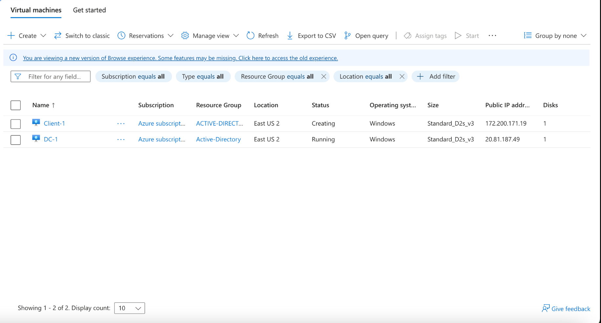

1. In the Azure portal, open **Virtual machines**.
2. Identify **DC-1**, the Windows Server VM intended to host domain services, and **Client-1**, the Windows client VM.
3. Check each VM's deployment status before connecting.

The screenshot shows both VMs in **East US 2**, using **Standard_D2s_v3**. DC-1 is running; Client-1 is still being created. These machines provide the server and workstation components of the lab.

### 2. Locate DC-1's network interface

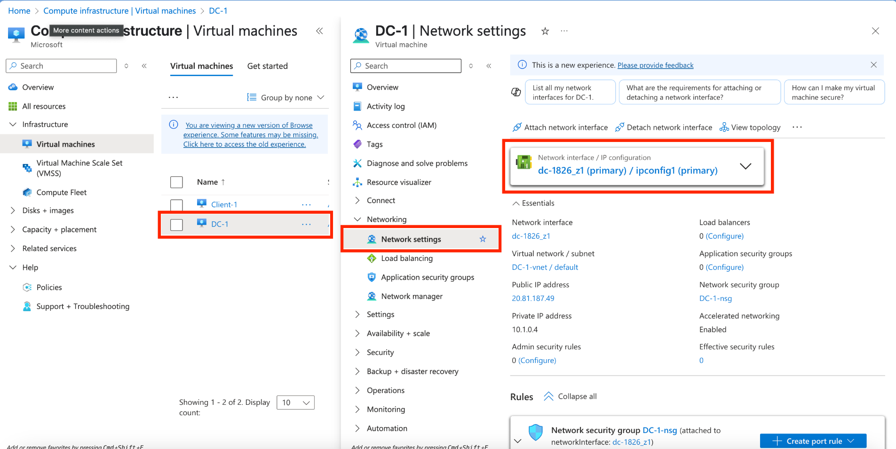

1. Select **DC-1**.
2. Open **Networking → Network settings**.
3. Select the primary network interface to access its IP configuration.

This view identifies the server's virtual network, subnet, network security group, and private IP address. The private address shown here is **10.1.0.4**.

### 3. Configure a static private IP address

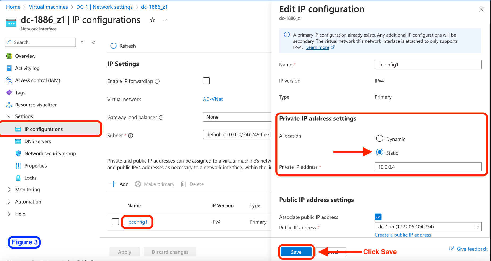

1. On the network interface, open **Settings → IP configurations**.
2. Select **ipconfig1**.
3. Under **Private IP address settings**, select **Static**.
4. Retain the appropriate private IP for the server's subnet and select **Save**.

A stable server address allows clients to consistently reach the intended DNS server.

**Screenshot context:** This image shows a different interface and network configuration: **AD-VNet**, subnet **10.0.0.0/24**, and address **10.0.0.4**. The surrounding DC-1 screenshots show **DC-1-vnet** and **10.1.0.4**. Use the address assigned to the actual server; these screenshots do not establish that the two configurations are the same environment.

### 4. Verify the static assignment

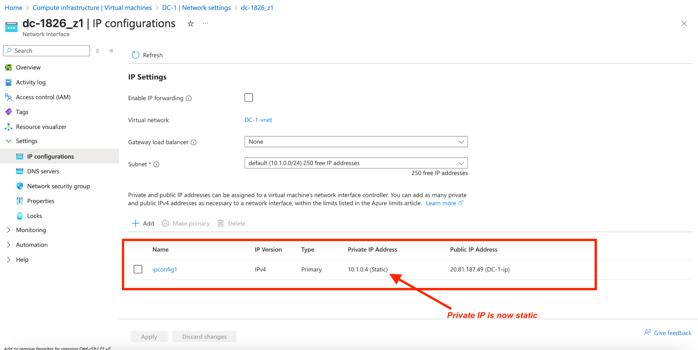

1. Return to DC-1's **IP configurations** page.
2. Check the private IP address listed for **ipconfig1**.
3. Confirm that its allocation is marked **Static**.

This screenshot verifies **10.1.0.4 (Static)** on DC-1's network interface in **DC-1-vnet**, using the **10.1.0.0/24** subnet.

### 5. Open Windows Defender Firewall

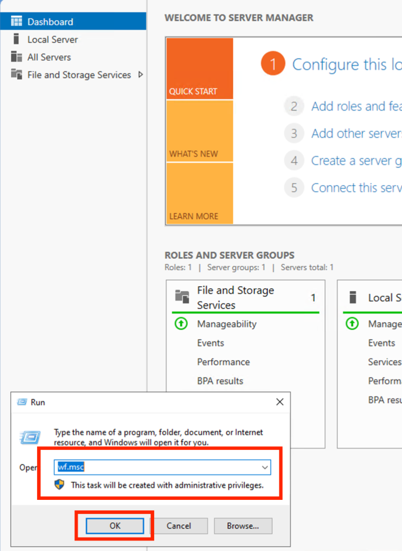

1. Connect to the Windows Server VM using Remote Desktop.
2. Press **Windows + R**.
3. Enter `wf.msc` and select **OK**.

This opens **Windows Defender Firewall with Advanced Security**, where host firewall profiles and traffic rules can be reviewed.

### 6. Review the firewall profiles

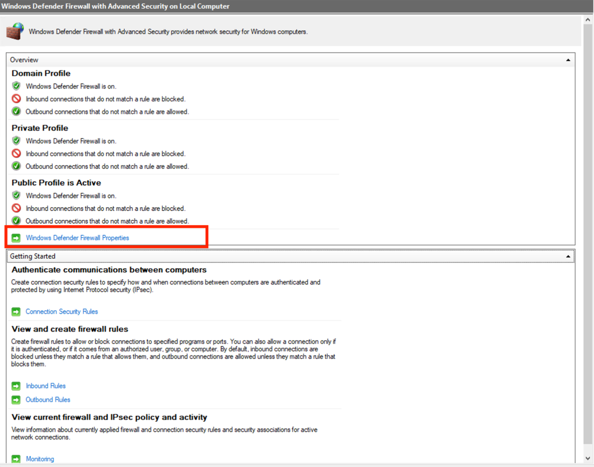

1. Review the **Domain**, **Private**, and **Public** profile summaries.
2. Select **Windows Defender Firewall Properties**.

The screenshot shows the firewall enabled for all three profiles, with the **Public** profile active. Reviewing the active profile helps identify which rules affect the connection being tested.

### 7. Review the lab firewall change

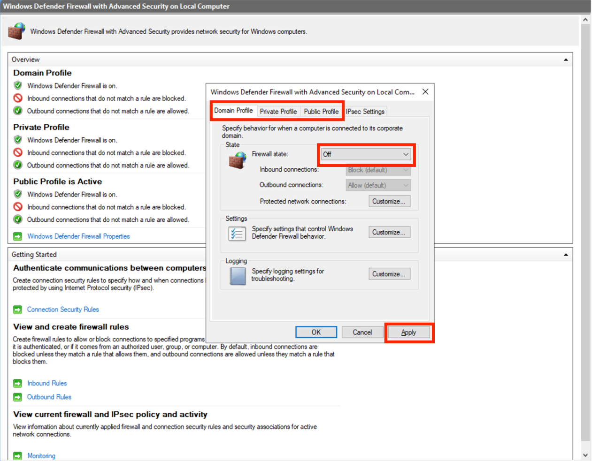

1. In Firewall Properties, select the profile tab being configured.
2. Review the **Firewall state** selection.
3. Select **Apply** to apply a change.

The screenshot shows **Off** selected for the **Domain Profile**. It does not verify that the Private or Public profiles were disabled or that this change was applied.

**Lab context:** Disabling a firewall is a broad troubleshooting change. For a maintained environment, keep the firewall enabled and use a narrowly scoped inbound ICMP echo rule for ping testing. Since the previous screen shows the Public profile active, changing only the Domain profile may not affect the current ping test.

### 8. Inspect Client-1's networking

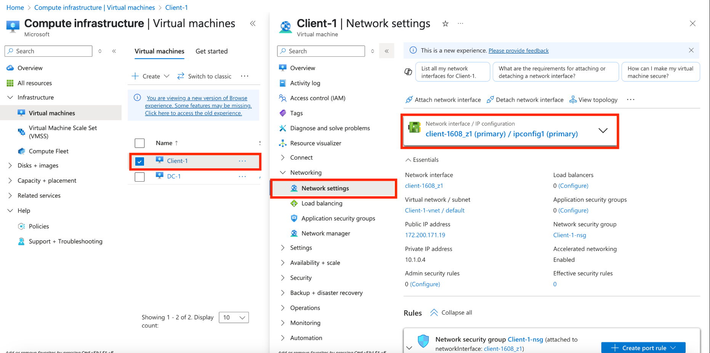

1. In Azure, select **Client-1**.
2. Open **Networking → Network settings**.
3. Select the primary network interface.

The screenshot shows **Client-1-vnet** and private IP **10.1.0.4**. DC-1's earlier screenshot shows **DC-1-vnet** with the same private address.

**Verification needed:** Different virtual networks do not automatically provide connectivity. Confirm that the lab uses a shared virtual network with distinct VM addresses, or an appropriate routed configuration with non-overlapping address spaces. The screenshots do not show this requirement being resolved.

### 9. Set Client-1's DNS server

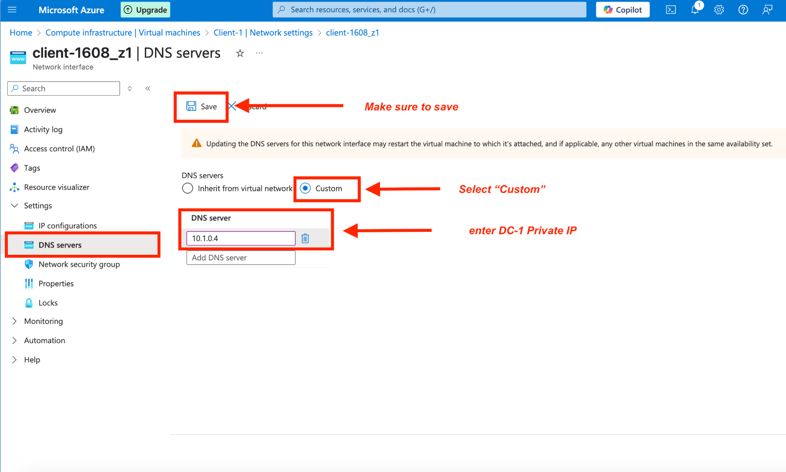

1. On Client-1's network interface, open **Settings → DNS servers**.
2. Select **Custom**.
3. Enter the verified private IP address of the intended DNS server.
4. Select **Save**.

The screenshot shows **10.1.0.4** entered as the DNS server. This setting is intended to direct the client's DNS queries to DC-1 once DNS services are available.

**Verification needed:** Client-1 is also shown with **10.1.0.4** as its own address. Resolve the addressing and network configuration before treating this as a working DC-1 DNS configuration. Entering a DNS address alone does not prove that a DNS service is installed or responding.

### 10. Restart Client-1

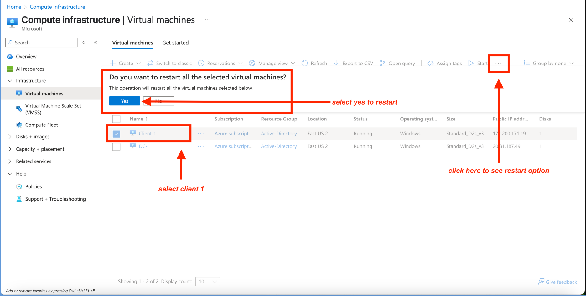

1. Return to the Azure **Virtual machines** list.
2. Select **Client-1**.
3. Open the toolbar's **More** menu and select **Restart**.
4. Select **Yes** to confirm, then wait for the VM to become available.

Restarting the client allows Windows to obtain the updated network settings. The screenshot captures the restart confirmation prompt.

### 11. Open PowerShell on Client-1

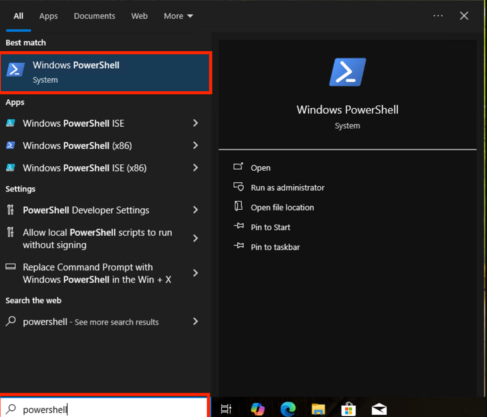

1. Reconnect to Client-1 after the restart.
2. Open **Start** and search for **PowerShell**.
3. Open **Windows PowerShell**.

PowerShell provides access to commands used to inspect the client's network configuration and test connectivity. The following screenshots show an elevated session, although basic `ping` and `ipconfig /all` checks do not require elevation.

### 12. Test the intended server address

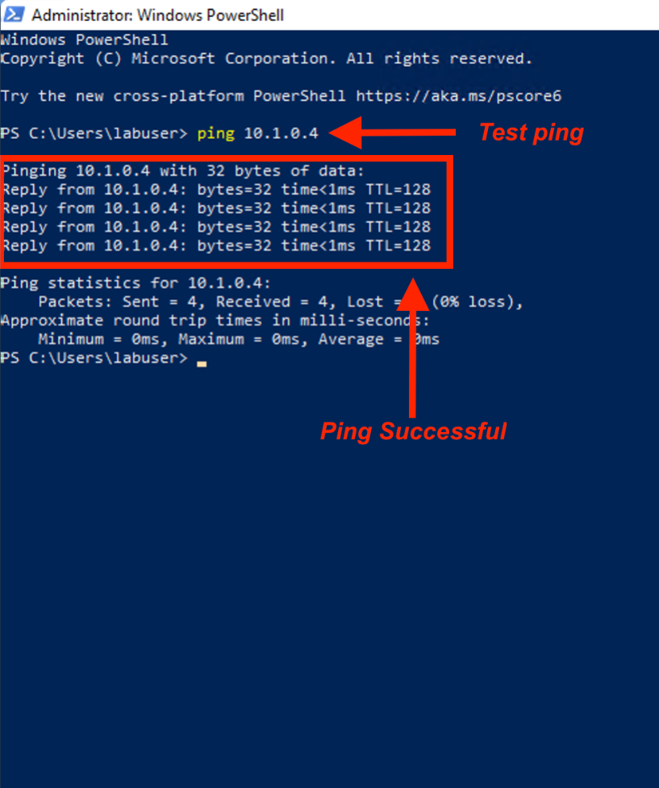

1. In PowerShell, run:

```powershell
ping 10.1.0.4
```

2. Review the replies and packet-loss summary.

The screenshot shows **four replies and 0% packet loss**.

**Result interpretation:** The next screenshot identifies **10.1.0.4** as Client-1's own IPv4 address. These replies may therefore be from the client itself and do not establish connectivity to DC-1. Repeat the test using DC-1's verified, distinct address after resolving the network configuration.

### 13. Inspect the client's IP and DNS settings

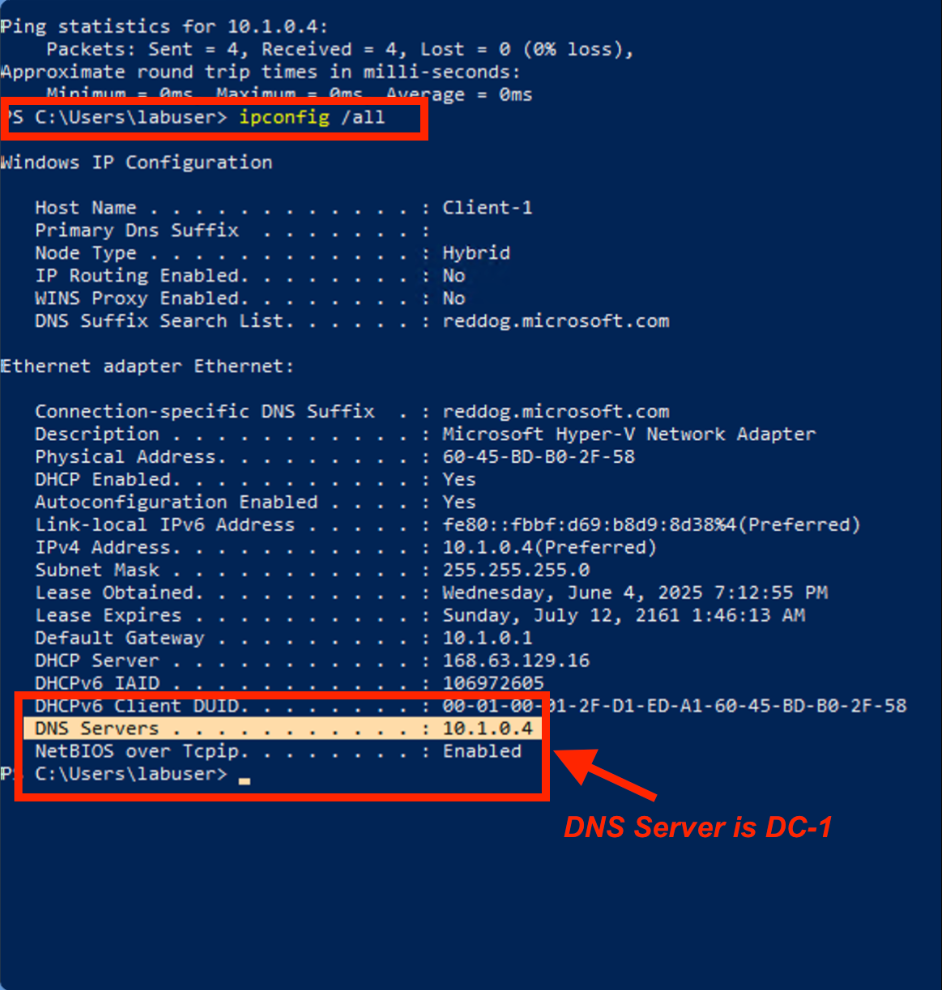

1. Run:

```powershell
ipconfig /all
```

2. Review **Host Name**, **IPv4 Address**, **Subnet Mask**, **Default Gateway**, and **DNS Servers**.
3. Compare the values with DC-1's verified network settings.

The output shows:

| Setting | Displayed value |
|---|---|
| Host name | Client-1 |
| IPv4 address | 10.1.0.4 |
| Subnet mask | 255.255.255.0 |
| Default gateway | 10.1.0.1 |
| DNS server | 10.1.0.4 |

This confirms that the configured DNS address appears in Windows. Because it matches the client's own address, the screenshot does not establish that Client-1 is using a separate DC-1 server for DNS. A DNS query to the verified server is still needed after the addressing issue is resolved.

## Validation Remaining

- Confirm DC-1 and Client-1 are on a network configuration that supports communication, with distinct private IP addresses.
- Confirm Client-1's custom DNS address points to DC-1 and that DNS is installed and responding.
- Repeat the connectivity test against DC-1 and capture updated output from both VMs.
- Verify that the firewall is enabled with the required scoped rules after lab troubleshooting.

Active Directory Domain Services installation, domain controller promotion, and domain joining are covered in the separate [AD Deployment and Configuration project](../ad-deployment-configuration/README.md). They are not demonstrated by this screenshot set.
