# Creating Users and Group Policy Objects for AD


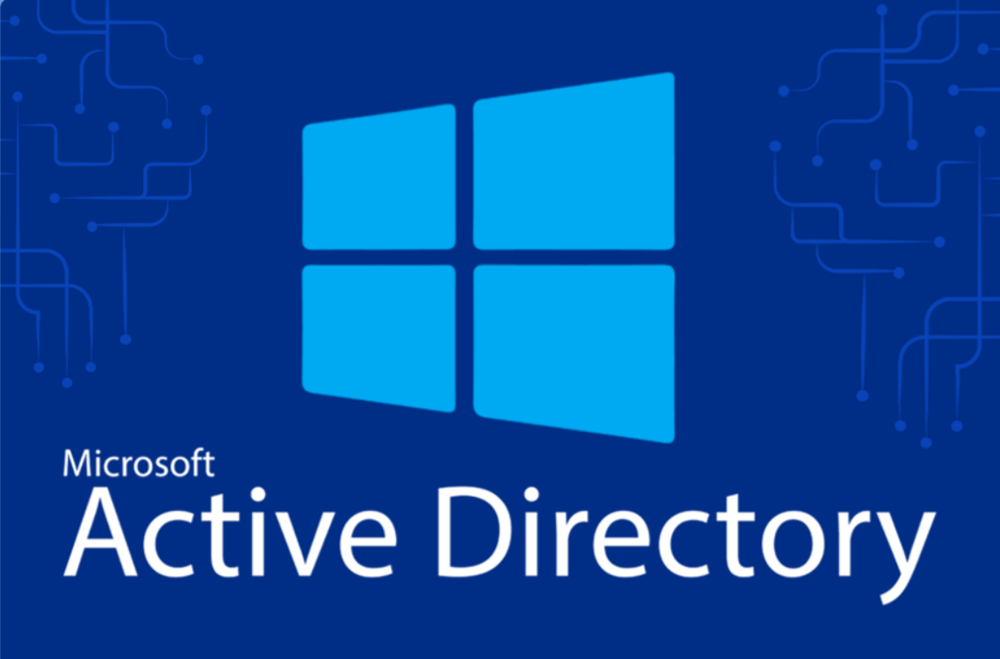

This walkthrough covers user provisioning and account security in a Windows Active Directory lab. It follows the process from creating test accounts with PowerShell to configuring account lockout policy, restoring access, and reviewing failed sign-in events.

## Skills Demonstrated

- Bulk user creation with Windows PowerShell ISE
- User administration in Active Directory Users and Computers (ADUC)
- Organizational unit (OU) navigation and account searches
- Group Policy Management and account lockout settings
- Domain sign-in testing and account recovery
- Security log investigation with Event Viewer

## Lab Environment

| Component | Role in the Walkthrough |
|---|---|
| `mydomain.com` | Active Directory domain |
| `DC-1` | Domain controller used for administration |
| `Client-1` | Domain-joined Windows client used for sign-in testing |
| `_EMPLOYEES` | OU containing generated test users |
| `bat.raj` | Example account selected for initial sign-in testing |
| `jus.pob` | Example account used for account recovery and administration |
| Default Domain Policy | Existing GPO edited for account lockout settings |

The screenshots document a training environment. The shared initial password and account settings visible in the bulk-creation example are lab conveniences, not a production account-provisioning standard.

## Part 1: Create and Verify Domain Users

### 1. Open PowerShell ISE as Administrator

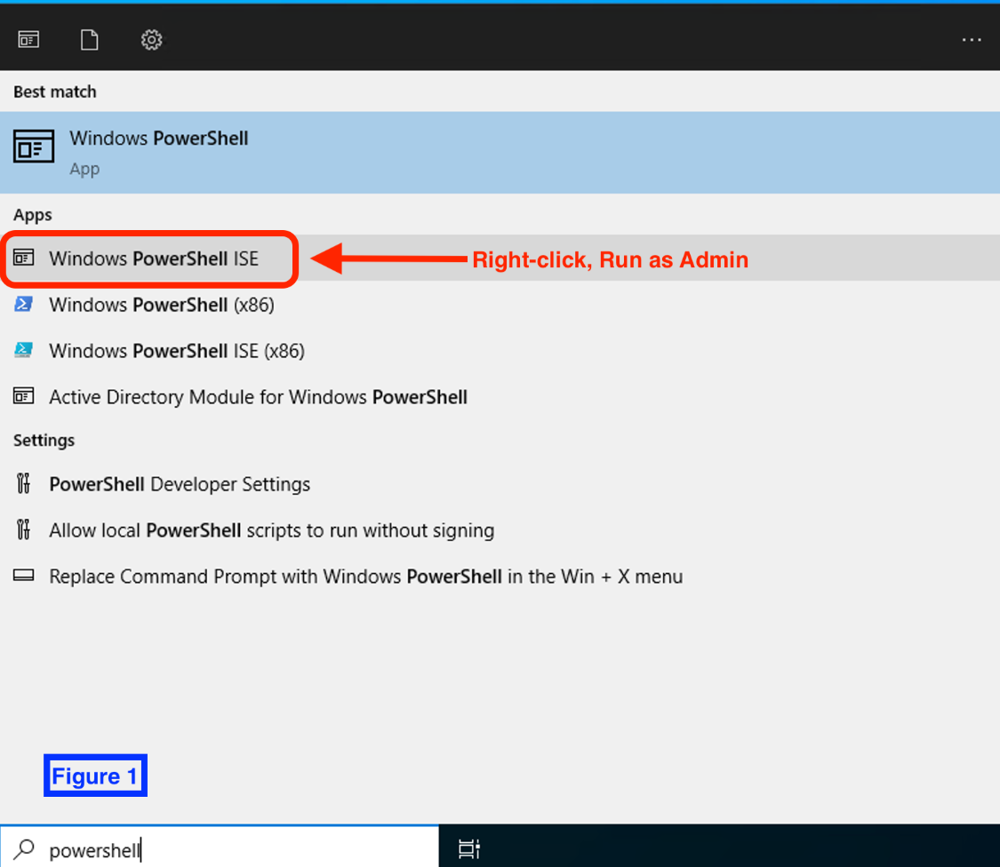

On **DC-1**, search for **Windows PowerShell ISE**, right-click it, and select **Run as administrator**. Use an account with permission to create users in the lab domain. PowerShell ISE provides a script editor and a console for reviewing execution output.

### 2. Review the User-Creation Script

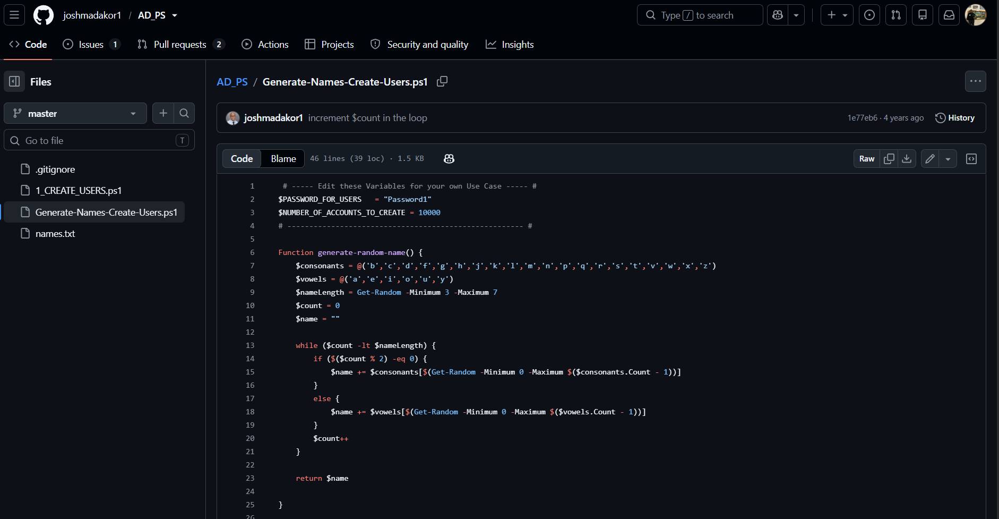

The screenshot references Josh Madakor's **AD_PS** repository and its **Generate-Names-Create-Users.ps1** script. Review the script before running it, including the account count, initial password, and target OU. This is a training resource used for the workflow, rather than original code developed for this project.

### 3. Load and Run the Script

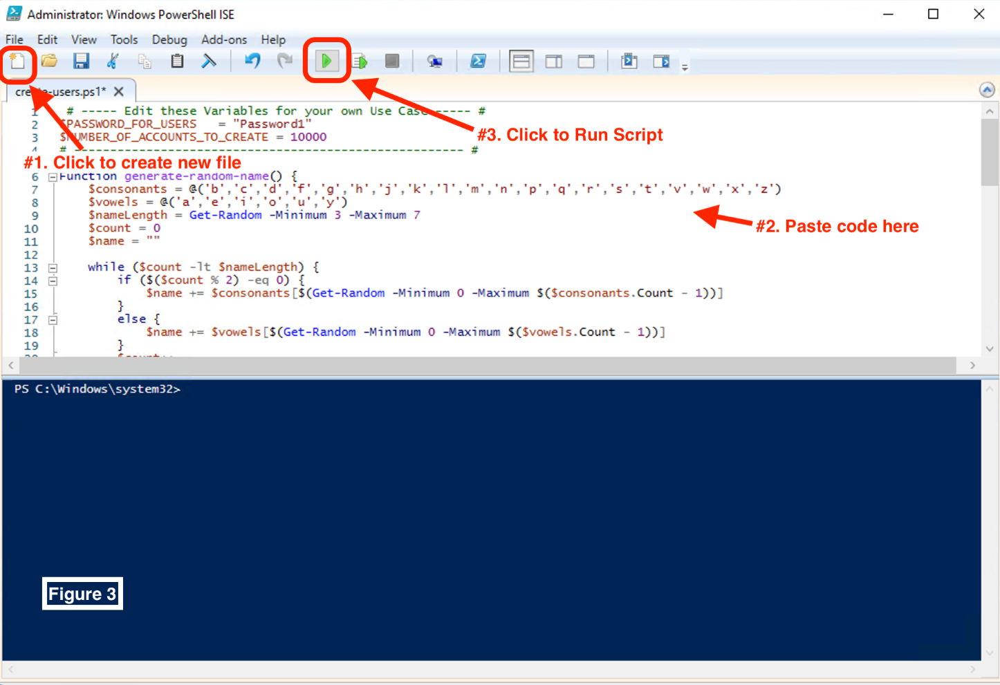

Create a new script file, paste the reviewed code into the script pane, and save it with a `.ps1` extension. Confirm the intended settings before selecting **Run Script** or pressing **F5**. The screenshot shows an account-count setting of **10,000**; this is the requested count, not proof that all accounts finished creating.

### 4. Monitor User Creation

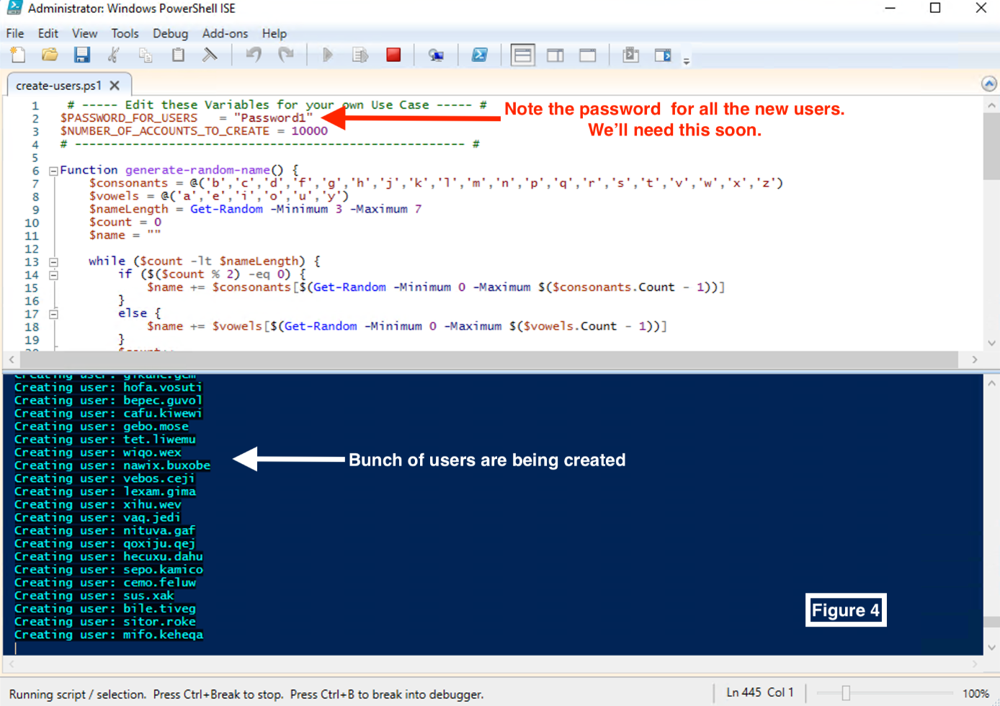

Watch the console for user-creation messages and errors while the script runs. The password variable supplies the initial password for the generated test accounts. Use the configured lab credential for the later sign-in exercise.

### 5. Verify Users in the Employees OU

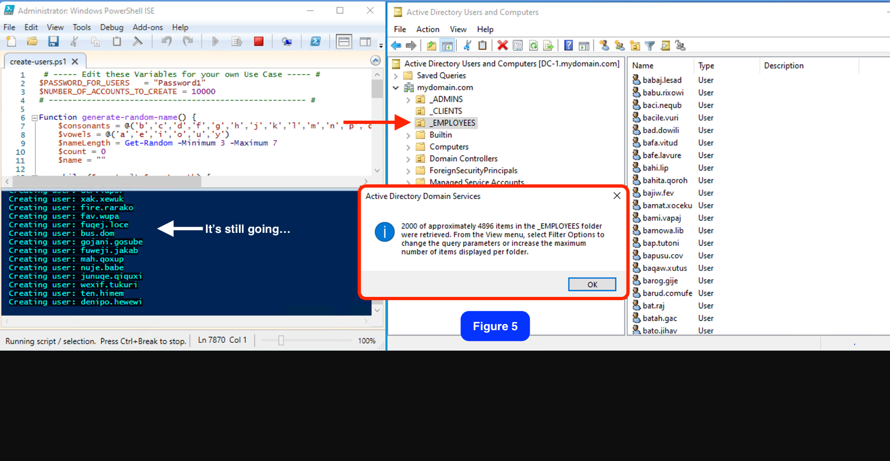

Open **Active Directory Users and Computers**, expand **mydomain.com**, and select **_EMPLOYEES**. Refresh the view to see newly created accounts. The screenshot shows that ADUC has reached its display limit while the script is still running. A limited result list does not mean user creation stopped or that accounts beyond the displayed results are missing.

### 6. Select a Test Account

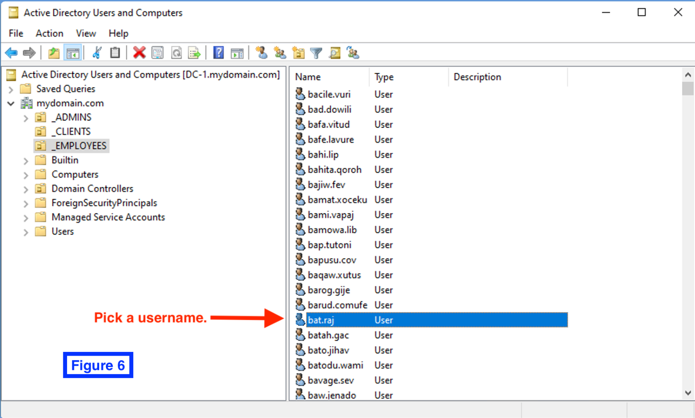

Choose a generated account for the initial sign-in test. This example selects **bat.raj**. Record the exact username so the client sign-in uses the intended domain account.

### 7. Test Domain Sign-In on the Client

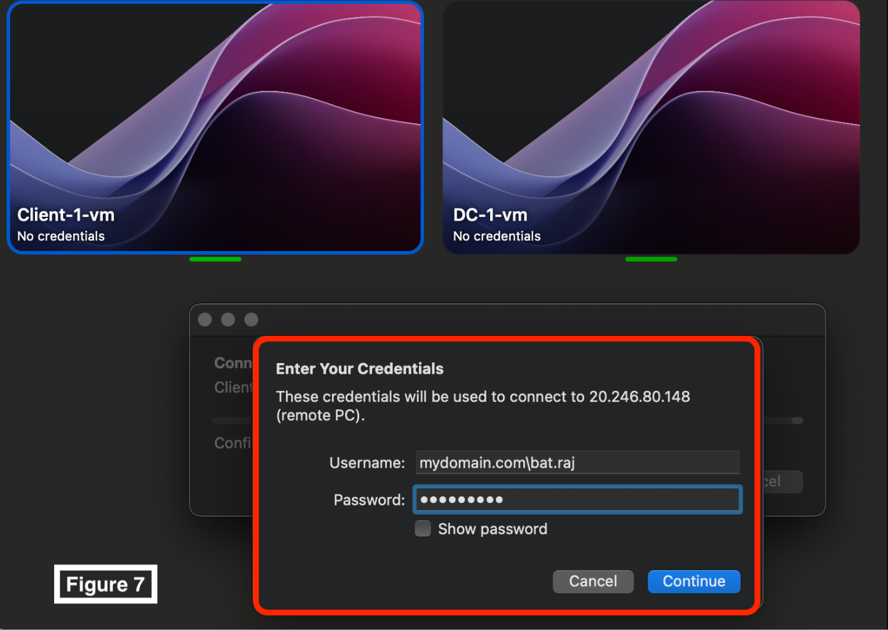

Connect to **Client-1** through Remote Desktop and enter the selected domain account and its lab password. The screenshot shows the credential-entry stage. A successful new session is the next check for confirming that the account can authenticate and has permission to sign in through Remote Desktop.

## Part 2: Configure Account Lockout Policy

### 8. Open Group Policy Management

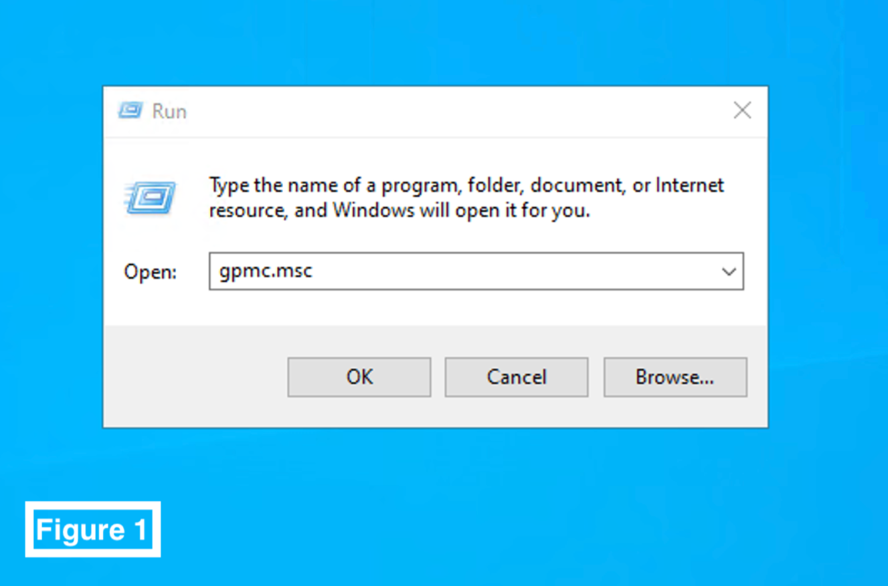

On **DC-1**, press **Windows + R**, enter `gpmc.msc`, and select **OK**. Group Policy Management is used to edit and manage policies applied to domain computers and users.

### 9. Edit the Default Domain Policy

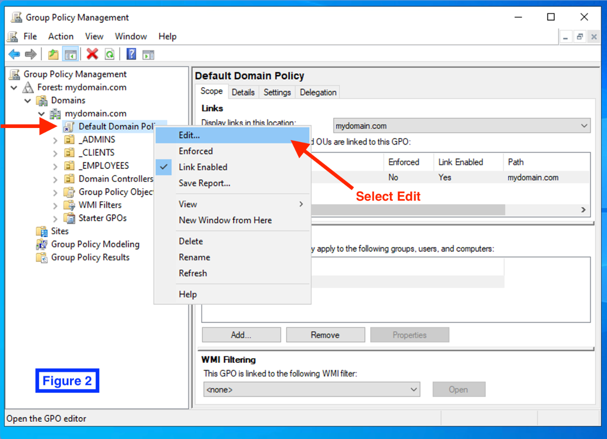

Expand **Forest: mydomain.com > Domains > mydomain.com**. Right-click **Default Domain Policy** and select **Edit**. This lab modifies the existing domain policy to configure account lockout behavior.

### 10. Locate Account Lockout Policy

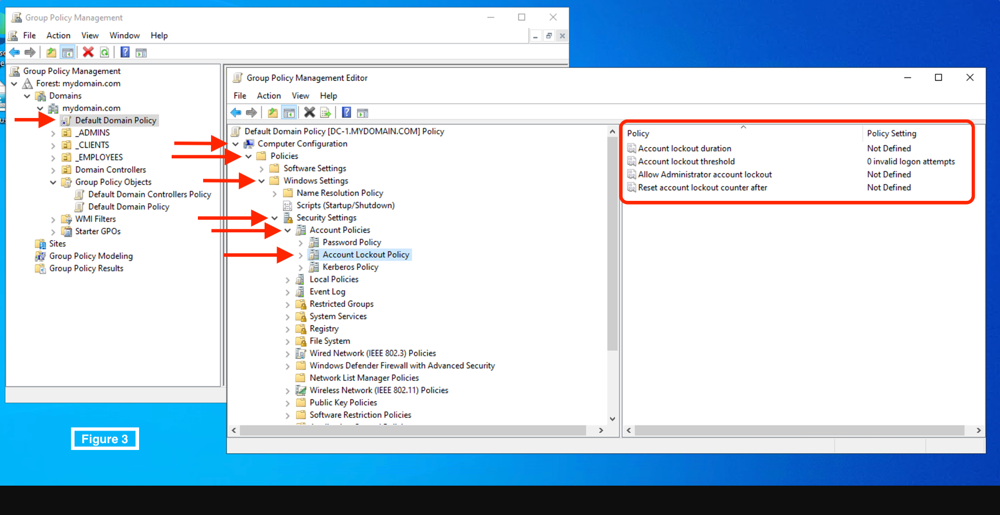

Navigate to **Computer Configuration > Policies > Windows Settings > Security Settings > Account Policies > Account Lockout Policy**. Review the existing settings before making changes. This section controls the failed-password threshold, lockout duration, and reset interval.

### 11. Set the Lockout Duration

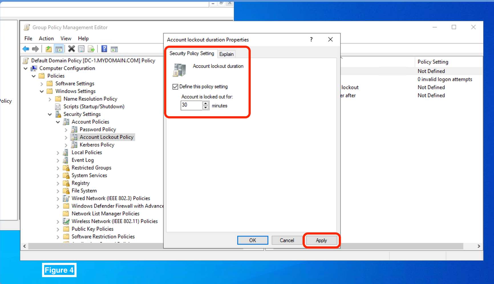

Open **Account lockout duration**, select **Define this policy setting**, and enter **30 minutes**. Select **Apply**. This sets how long an account remains locked before automatic recovery, unless an administrator unlocks it earlier.

### 12. Review the Related Settings

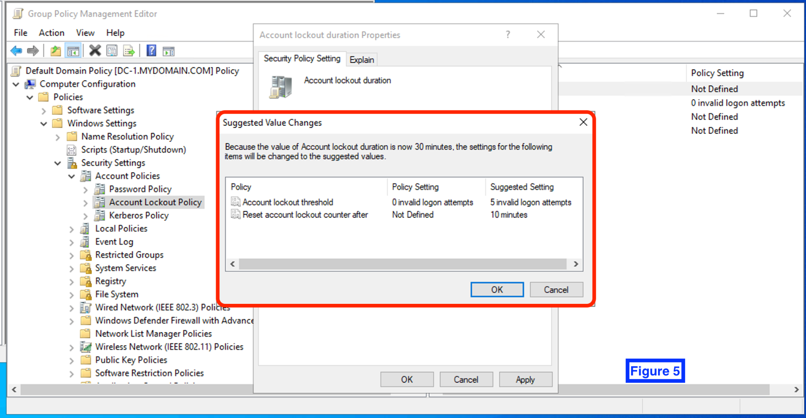

Review the **Suggested Value Changes** dialog. In this example, it proposes a threshold of **5 invalid logon attempts** and a counter-reset interval of **10 minutes**. Select **OK** to accept these values for the lab, then close the properties dialog.

### 13. Confirm the Final Policy Values

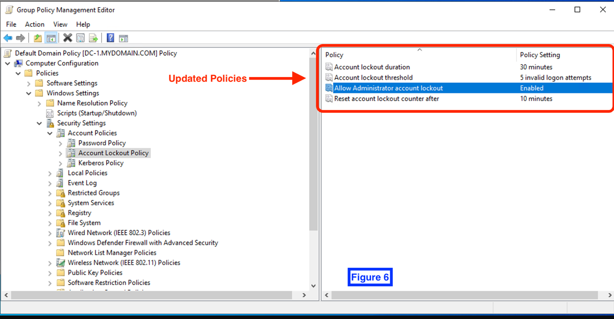

Review the policy list and confirm the settings match the intended lab configuration:

| Setting | Value Shown |
|---|---|
| Account lockout duration | 30 minutes |
| Account lockout threshold | 5 invalid logon attempts |
| Reset account lockout counter after | 10 minutes |
| Allow Administrator account lockout | Enabled |

These are the values shown in the walkthrough, rather than a universal policy recommendation for every organization.

### 14. Refresh Group Policy

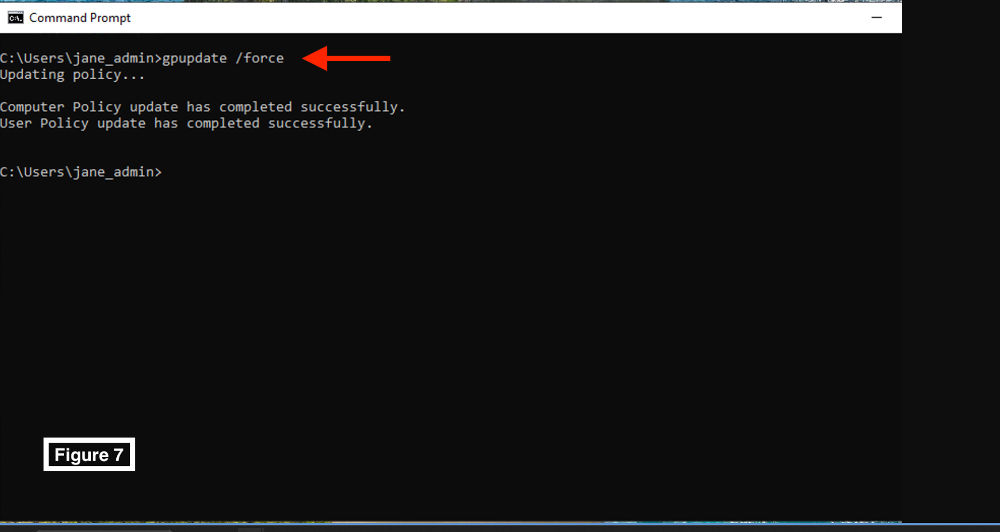

Run the following command on the lab computer whose policy you are refreshing:

```cmd
gpupdate /force
```

The screenshot reports that both computer and user policy updates completed successfully. This confirms policy processing on that computer; the following sign-in exercise checks the resulting lockout behavior.

## Part 3: Test Lockout and Restore Access

### 15. Observe a Locked-Account Sign-In Failure

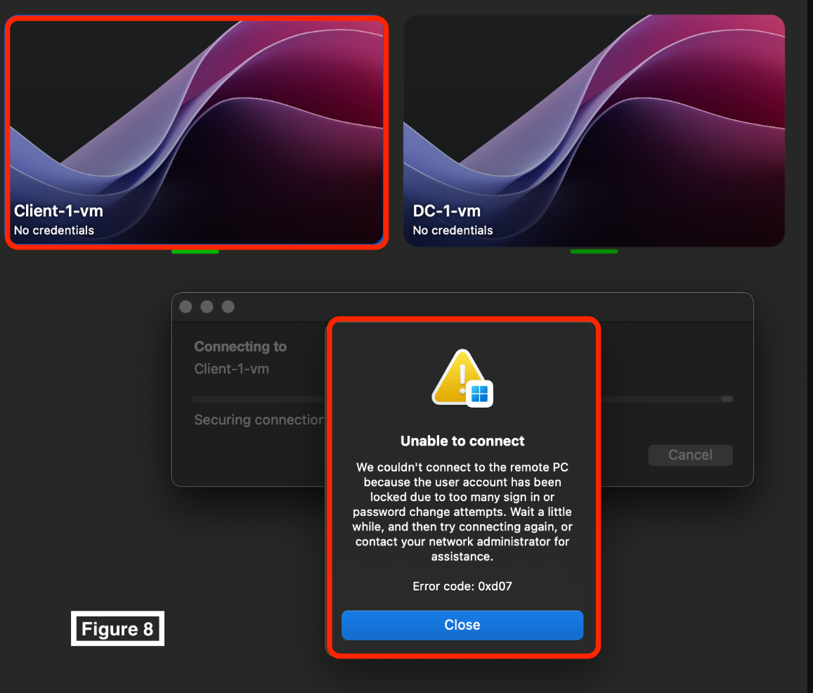

In the controlled lab, test the lockout policy with an incorrect password for a designated test user. The screenshot shows Remote Desktop rejecting a connection because the account is locked after too many sign-in or password-change attempts. Record the affected username and error before changing the account.

### 16. Find the Affected Account

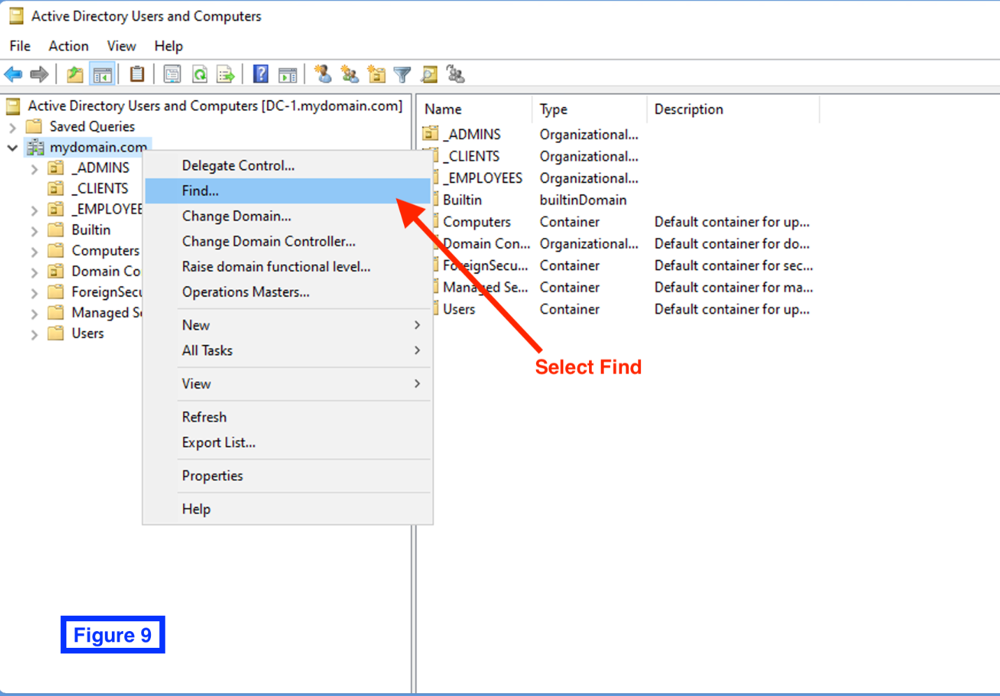

Return to **DC-1** and open **Active Directory Users and Computers**. Right-click **mydomain.com** and select **Find**. Searching the domain helps locate an account without manually browsing a large list of generated users.

### 17. Unlock the Account

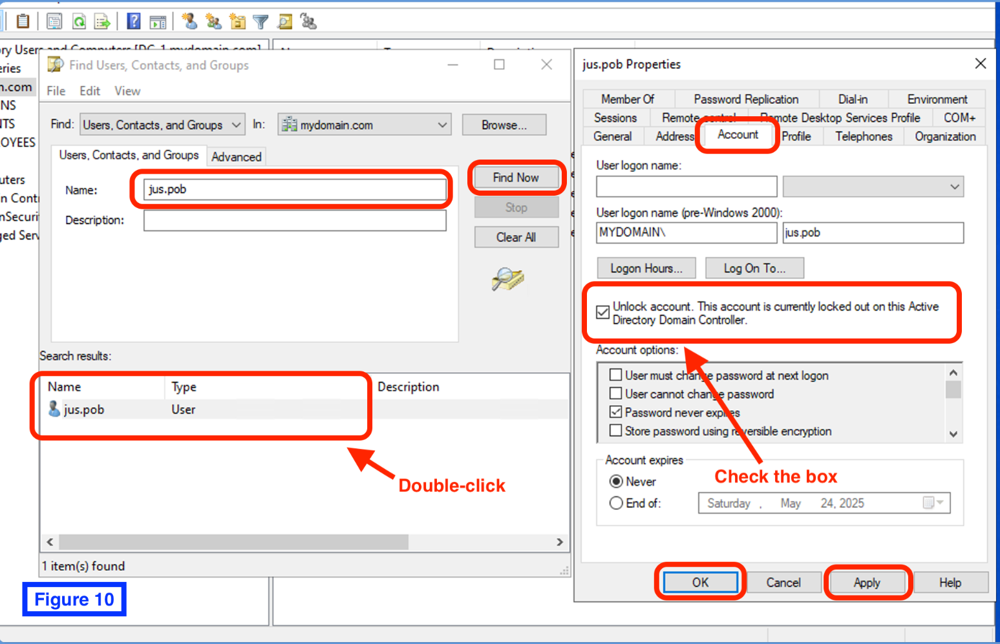

Search for **jus.pob**, select **Find Now**, and double-click the matching user. On the **Account** tab, review the lockout message, select **Unlock account**, then select **Apply** and **OK**. Unlocking removes the lockout condition; it does not change the user's password.

### 18. Verify the Signed-In Identity

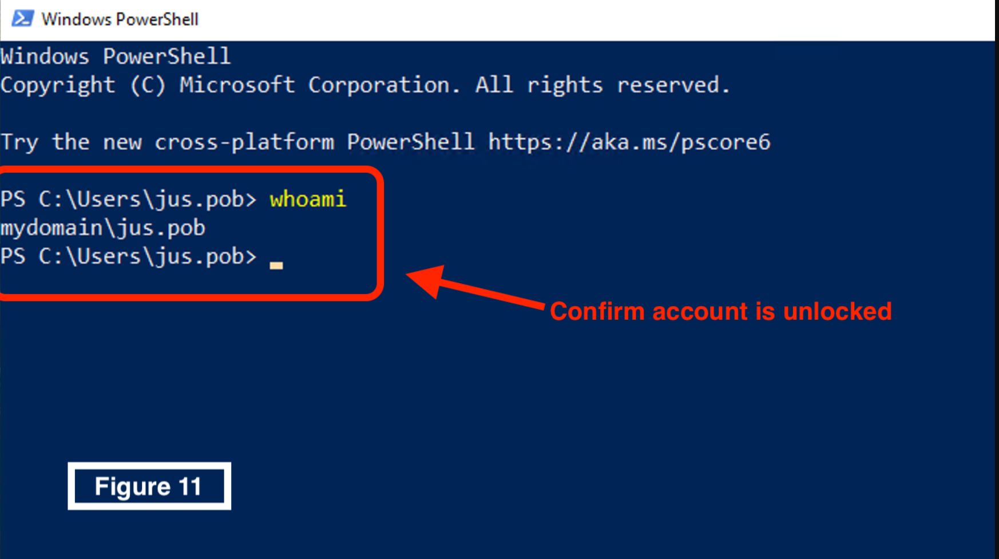

After unlocking the account, establish a new client session using the correct credentials and run:

```cmd
whoami
```

The screenshot returns `mydomain\jus.pob`, identifying the account in the current session. A successful fresh sign-in verifies restored access; `whoami` by itself does not query the account's current lockout state in Active Directory.

## Part 4: Practice Account Administration and Log Review

### 19. Locate the Disable Account Action

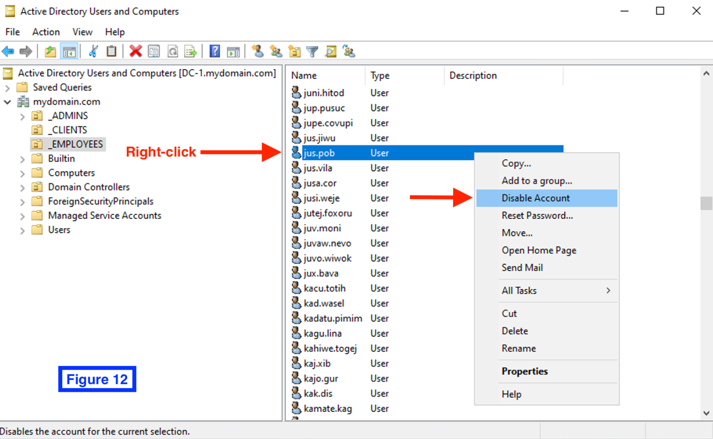

Right-click the test account in ADUC to locate **Disable Account**. Disabling an account prevents new sign-ins while retaining its directory object. This differs from a temporary lockout caused by failed authentication attempts. The screenshot shows the action being selected, not a separate confirmation of completion. Re-enable a disabled test account before continuing sign-in tests.

### 20. Locate the Password Reset Action

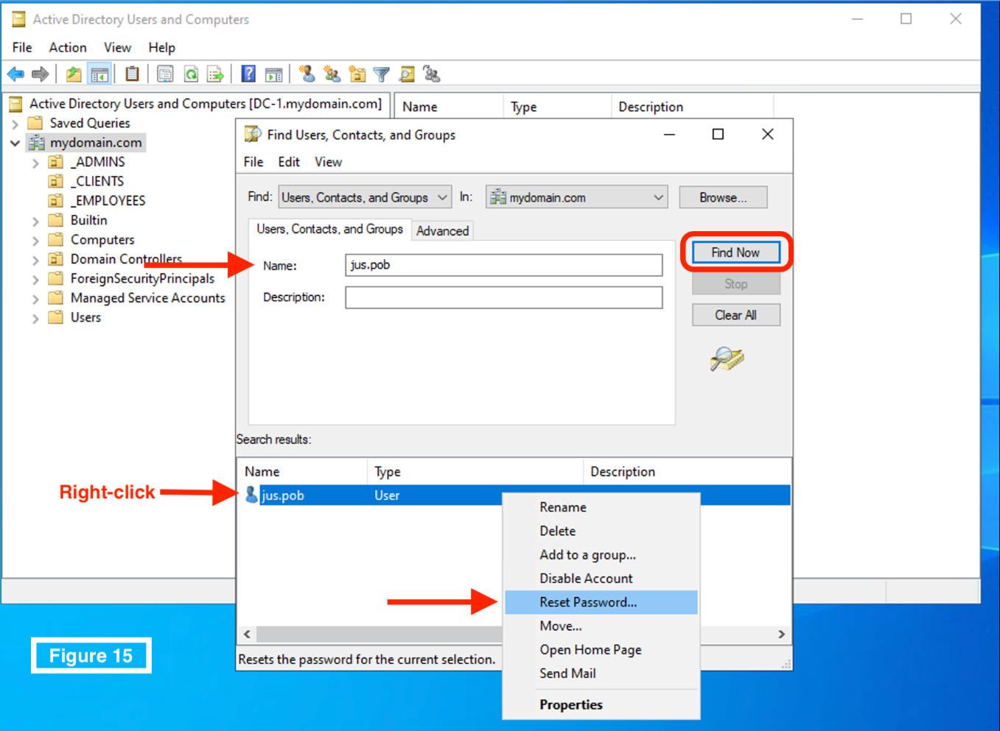

Find **jus.pob**, right-click the result, and select **Reset Password** to open the reset dialog. A password reset changes the credential used for future authentication. The screenshot documents where to start this task; it does not show a completed reset. In a support workflow, verify the user's identity before performing the reset and test access afterward.

### 21. Investigate Failed Sign-Ins in Event Viewer

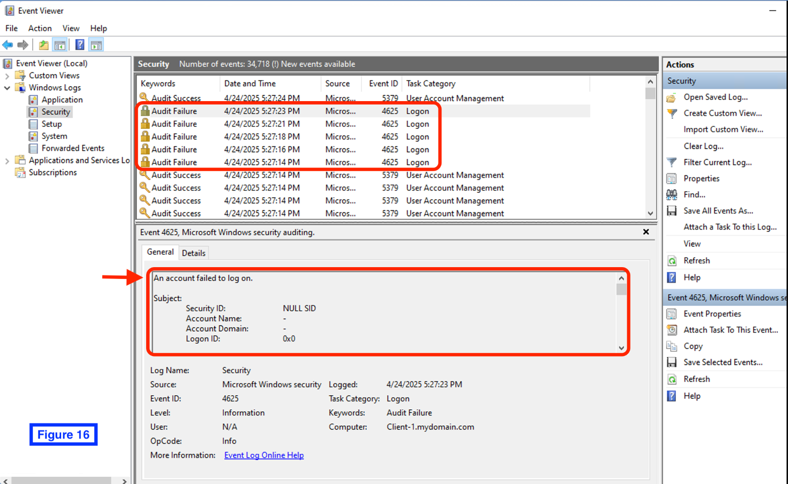

Open **Event Viewer** on **Client-1** and navigate to **Windows Logs > Security**. Use **Filter Current Log** to look for Event ID **4625**, then inspect a matching event. This event records a failed sign-in on the computer where the attempt occurred. Review the account, timestamp, logon type, and failure information to investigate the cause. Multiple failures alone do not establish whether the cause was a wrong password, a locked account, or another authentication issue. See [Microsoft's Event 4625 reference](https://learn.microsoft.com/en-us/windows/security/threat-protection/auditing/event-4625).

## Project Summary

This completed walkthrough documents bulk account provisioning, domain account searches, account lockout policy configuration, and account recovery in an Active Directory lab. It also covers the entry points for disabling accounts and resetting passwords, followed by Security log review.

The workflow connects routine help desk tasks with centralized Windows administration: identify the affected account, review its state, make the appropriate change, and verify access through a new sign-in.
